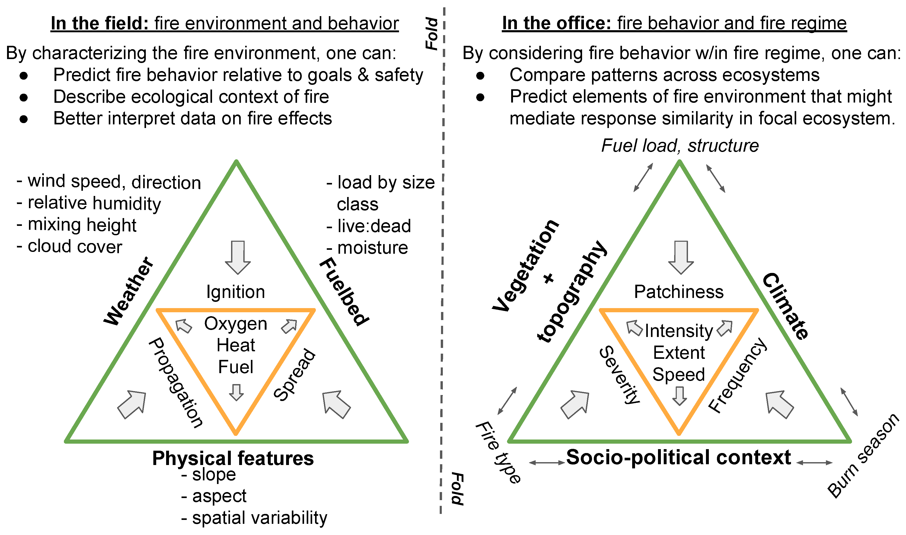
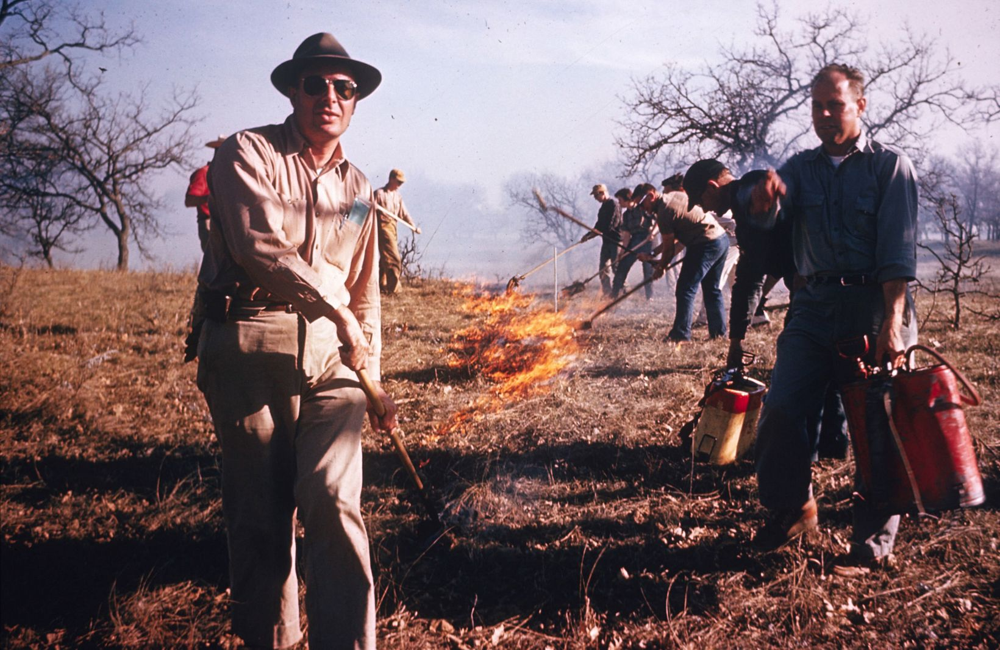
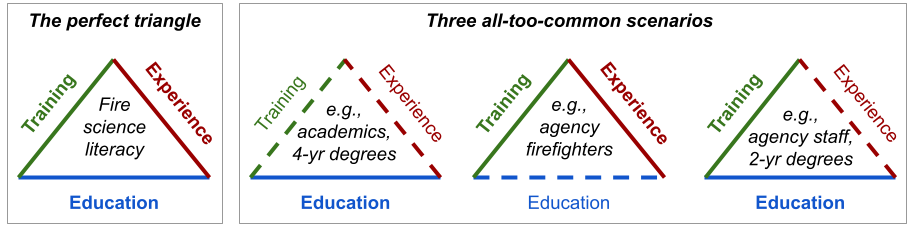
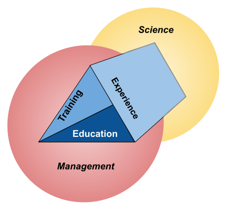
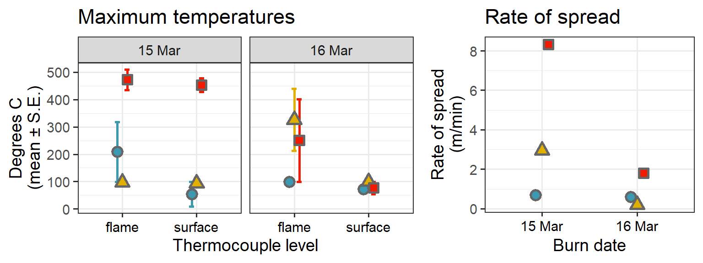
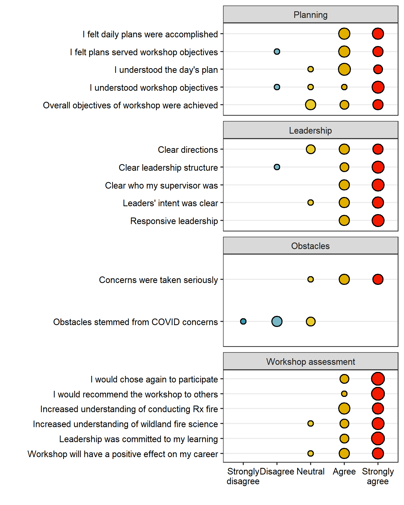
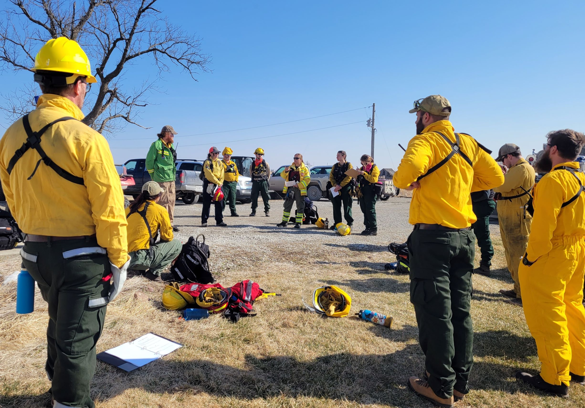
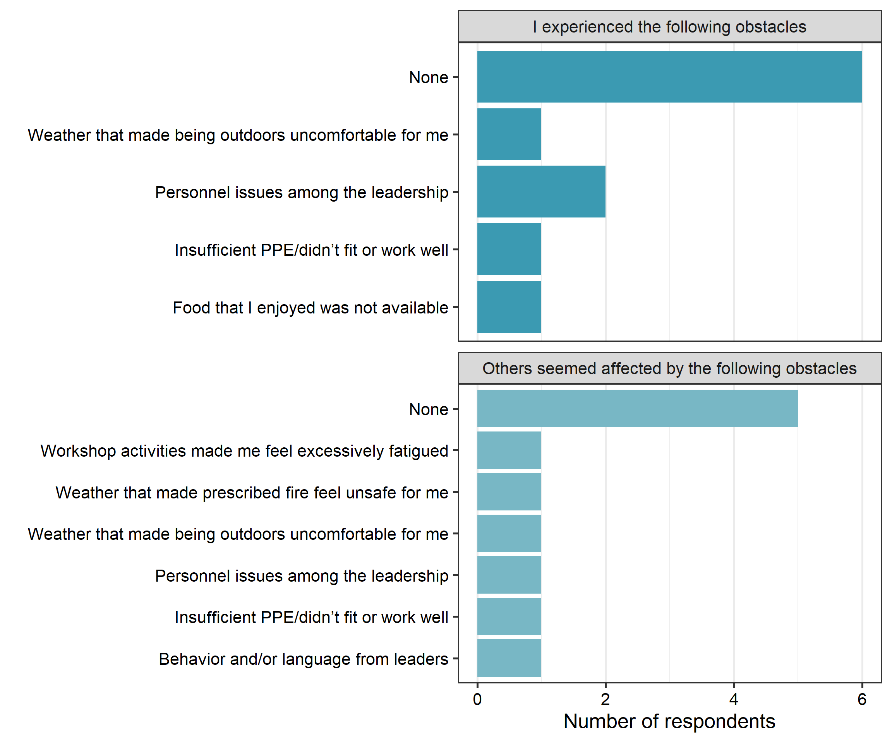

  
# Introduction 

Rapidly addressing and effectively managing the "wicked problems" of wildland fire management--from controlling wildfires to administering prescribed burns in fire-dependent ecosystems--demands *wildland fire literacy*--the capacity for wildland fire professionals to understand and communicate fundamentals of fuel and fire behavior within the socio-ecological elements of the fire regime (Fig.~\ref{wallet_card}).
But existing modes of education, training, and experience-building are insufficient to bridge persistent gaps between wildland fire science and management. 
In this Feature Paper, we summarize the history and state of professional development in the wildland fire community and describe the motiviations, successes, and opportunities to improve a novel mode of integrating both training and experience in both studying and conducting prescribed fire. 

## Background on wildland fire management and training

> In the measurement of fire weather and forest inflammability ... it is necessary to use many methods peculiar to this work. 
Some of these methods are familiar to meteorologists, but few foresters have had any appreciable training in meteorology. 
Others are of such recent development and so specially designed for forest protection that they are unknown to most meteorologists and are not yet taught in the schools of forestry or described in any textbooks. 
... Much of this information is assembled in this circular for more convenient reference. (H. Gisborne [@gisborne1936], p. 1)

While the United States wildland fire community has long recognized the need to improve education and training in fuels, fire behavior, and management, a cohesive curriculum encompassing the science and practice of wildland fire use has yet to emerge.
On one hand, some of the original standards for fire management and research on the fire environment were developed in tandem, given the applied emphasis Harry Gisborne placed on using his seminal work on weather and fuel moisture to inform the preparation, deployment, and safety of fire control resources, beginning in the 1920s [@hardy1983]. 
On the other hand, while theoretically applicable to using wildland fire as well as fighting it, these standards were solidly oriented within the mode of fire suppression: *the sole purpose of the weather and inflammability measurements described herein is to improve forest-fire control* [@gisborne1936]. 
The US Forest Service, having effectively defeated any support of "light burning" or other wildland fire use, controlled fire research funding as early as 1928 and by 1935 clearly established an aggressive policy of suppression [@pyne2015]. 
Enclaves of advocates for fire use moved their discussions beyond the reach of the anti-fire establishment, such as the Tall Timbers Fire Ecology Conference [@pyne2015]. 

Management agencies began to adopt prescribed burning through the latter half of the 20^th^ century. 
Legislative, bureaucratic, and even cultural changes first opened the National Park Service then the US Forest Service to prescribed fire that included both pre-planned and intentionally-set burns and natural ignitions allowed to spread through designated wilderness areas under prescribed conditions [@pyne2015]. 
The Nature Conservancy conducted its first prescribed fire in 1962 [Fig. 1, @pyne2015; @tnc2022]. 

Meanwhile, management of wildland fire operations developed as well, becoming more specialized as standardized command-and-control systems evolved. 
Disastrous fires in 1970 prompted developments that became the National Wildfire Coordinating Group (NWCG) and the Incident Command System (ICS), which the NWCG in turn adopted and agencies had widely employed by 1985 [@dague2015; @wilson1978]. 
The ICS has facilitated cross-boundary collaboration among agencies and jurisdictions in the US as well as among participating nations [@goldammer2004].
But some local fire departments bristle at the constraints of the ICS [@jensen2011], and the hierarchical structure of training, certification, and qualification for positions within the ICS can create a barrier to allowing otherwise experienced personnel conduct prescribed burns. 
In fact, as early as the 1980s, the US Fish and Wildlife Service condensed the content of 140 hours worth of NWCG coursework into a 36-hr course that combined principles of both prescribed fire and wildfire suppression, to reflect the changing demands on USFWS personnel [@murphy1987]. 

## State of wildland fire education and training today

> The ideal system for preparing the next generation of fire professionals would integrate and/or provide in parallel education, training, and experience. 
Such a system would share characteristics with educational models used in other professions such as law, business, and medicine, where coursework is offered in conjunction with summer job experiences, training courses, and extensive internships. [@kobziar2009; p.344]

Unfortunately wildland fire professionals rarely achieve a sufficient amount of training, education, and experience. 
Kobziar [@kobziar2009] identified three common syndromes of lopsided professional development (Fig.~\ref{FireTrainingTriangles}). 
The main issues are disparities between *education* (receiving knowledge on the fire environment, fire effects, and how and why one might conduct a prescribed fire), *training* (being taught how to use and apply various fire management resources), and *experience* (a background of having performed fire management tasks). 
Employees of agencies and non-governmental organizations with substantial training and experience, such as seasonal firefighters and other crewmembers, have often received limited education in fire science and encounter limited opportunity to receive more instruction. 
Meanwhile, graduates of academic programs, academic researchers, and staff in professional positions might have a substantial amount of education and even some training, but lack experience working on actual fires. 
For example, technical specialists like Resource Advisors (READ) need only to meet basic Firefighter Type 2 (FFT2) certification and physical fitness requirements before being assigned to complex incidents: *the bottom line is that, in my opinion, the general lack of hands-on training of fire archaeologists after they earn their red cards is a recipe for disaster.* [@hangan2010, p. 3]

Gaining experience with prescribed fire, specifically, has been a persistent problem. 
Writing in 1985, Heitlinger & Davis [@heitlinger1985] highlighted the need for hands-on experience with prescribed fire among their review of available workshops and university courses related to fire ecology and management. 
Decades later, just a few universities offer programs in prescribed fire, specifically, and only a subset of those provide hands-on experience with live fire [@kobziar2009]. 
Oklahoma state University is one example that augments classroom-based courses in fire ecology with experiential learning that includes conducting prescribed fires; a survey of participants indicated that hands-on experience with prescribed fires were the most valuable opportunities of the program [@scasta2015]. 
Outside of the university setting, opportunities for hands-on experience with prescribed fire range from demonstrations aimed at landowners (e.g., Society for Range Management's Range Practicum; [@barnes2021]) to multi-day learn-and-burn operations (e.g., Prescribed Fire Training and Exchanges, or TREX; [@spencer2015]). 

## Bridging gaps between science and management

>There are reasons other than to smell smoke and escape from the classroom to justify the time and expense involved in setting up a fire exercise. [@andrews1989; p. 50]

Despite these advancements in prescribed fire experience, there remains a paucity of fire science integration in the education and training of wildland fire and natural resource professionals. 
In many tertiary natural resource programs, education is often limited to fire effects on natural resources, with students gaining little exposure to interactions between fuels, weather, and the fire behavior that drives fire effects. 
As for training, only at the highest levels of leadership or position specialization do managers pursuing professional development through the ICS receive extensive and comprehensive training in the wildland fire environment (Table~\ref{tab:trainging}). 
Basic wildland firefighter certification includes only a minimal amount of training in fire behavior (S-190: 7 hrs in-person and 6-8 hours online). 
The second fire behavior course, S-290, introduces interactions between fuels and topography, weather, and fire behavior, but is primarily aimed at training supervisors to recognize potentially dangerous conditions for their crew.
Even within the context of wildfire suppression, training to recognize and mitigate hazards associated with extreme fire behavior does not reflect the most recent scientific understanding, and the needs of crew leadership on the fireline often differ from those of incident command [@werth2016]. 
Knowledge gaps between research and prescribed fire management appear to be even less recognized in the wildland fire community. 

Course                                       | Duration (hrs, instructor-led/self-directed) | General content/objectives | Target audience
---------------------------------------------|----------|----------------|-----------------
[S-190, Intro. Wildland Fire Behavior](https://www.nwcg.gov/publications/training-courses/s-190) | 7/6-8 | Fuels, weather, topography; Recognize critical fire weather, alignment, and danger risk | All qualified crewmembers
[S-290, Intermediate Wildland Fire Behavior](https://www.nwcg.gov/publications/training-courses/s-290)| 37/15 | Tactical implications of interactions between fuels, weather, topography; Causes of extreme fire behavior | All supervisory positions
[Rx-310, Introduction To Fire Effects](https://www.nwcg.gov/publications/training-courses/rx-310)*| 32-36/0 |Understand fire as ecological process; fire regime; first-order fire effects; interactions between fire management and natural resources | Rx fire leadership, Resource Advisors
[S-390, Intro Wildland Fire Behavior Calculations](https://www.nwcg.gov/publications/training-courses/s-390) | 42-44/0 | Learn to use and interpret fire behavior prediction models | Incident commanders, Burn bosses 
[S-490, Advanced Fire Behavior Calculations](https://www.nwcg.gov/publications/training-courses/s-490)*| 44-47/0 | Use advanced techniques to predict fire behavior and make projections for fire growth | Fire and Fire Behavior Analysts, Burn bosses

\* Note that both Rx-310 and S-490 are followed by specialized intensive 500-level courses that are required to complete their respective qualification series. 

Although gaps between researchers and practitioners have been described in almost every professional field from health care to conservation biology [@stott2012; @prendergast1999] and across land management broadly [@carter2020], gaps between wildland fire scientists and managers can be particularly wide. 
Often, the gaps can be literal distance in space and time, in the sense that many scientists cannot participate in or even directly observe fire management operations that adhere to ICS requirements for training and certification.
As ICS protocols expand from federally-managed wildfire incidents to prescribed fire operations managed by state agencies and NGOs (e.g., TNC adopted NWCG ICS standards in ... *Ryan can you help me out here?*), scientists are increasingly distanced from making real-time observations and measurements of fire as it happens. 

Not only are education, training, and experience necessary to develop wildland fire literacy, the triad must be developed in both the realms of fire science and management (Fig.~\ref{ScienceManagement}). 
While completion of online coursework can help clear some administrative hurdles for scientists posed by ICS requirements, there are few substitutes for the experience gained by experiencing live fire.  
Observation of live fire has long been recognized as a critical factor in understanding fire behavior and the challenges it poses to fire management [@alexander1990; @andrews1989].
Understanding how 
And conversely, understanding which components of the fire environment can be measured and how should help fire managers understand how to incorporate new fire science information into their planning and operations. 

Here, we report on a Hands-on Fire Science Methods workshop designed to promote wildland fire literacy, held in the Midwestern US in the spring of 2022. 
We provide an overview of the workshop's objectives and activities, as well as a reflective critique in the form of "lessons learned" informed by a group debriefing of the workshop leadership and instructors (the cadre) and an anonymous online survey of workshop participants. 
While the workshop was widely viewed as a success, we also discuss elements that merit consideration or improvement in future iterations of this workshop or others with similar objectives and/or audiences. 

# Briefing 

Here we describe the intentions and operations of the course. 

## Leaders' intent 

The workshop was intended to provide early-career fire professionals hands-on experience with tools and techniques relevant to prescribed fire science and management, with a focus on grassland ecosystems. 
The objective was to develop wildland fire literacy by emphasizing two distinct arenas: Best practices for conducting robust wildland fire science, including collecting data on fuels, fire weather, and fire behavior; and strategies and tactics for safe and effective prescribed fire operations. 
Broadly speaking, the workshop was designed to meet the objective by providing equal opportunity for early-career professionals to learn and experience both fire science data collection and conducting prescribed burns, regardless of their familiarity--or lack thereof--with either arena. 
Activities were designed to be as hands-on as possible and aimed to provide ample opportunity for students to learn from course instructors as well as other participants. 

A secondary intention was to provide career development opportunities for participants with specific needs that fit into the workshop. 
This was aimed mostly at trainees with open [Position Taskbooks](https://www.nwcg.gov/publications/position-taskbooks/about) for qualification to achieve ICS positions.
While no such opportunities were guaranteed to participants, leadership recognized that several participants had open taskbooks for which members of the teaching cadre could provide signatures if the opportunity for trainees to perform tasks arose during the workshop. 
*As such, the workshop was formally included in the ICQS as... Ryan please replace this sentence with something about the workshop as an Incident?*

## Procedure

Here we describe logistical considerations from the perspective of planning a successful operation that included as much flexibility as possible to satisfy workshop objectives without 

### Date and location

The Hands-on Fire Science Methods Workshop was held 14-18 March 2022 at The Nature Conservancy's Dunn Ranch Prairie near Eagleville, Missouri, USA. 
This week was specifically selected from a review of spring break schedules for popular natural resource universities in the Midwestern US to accommodate as many graduate students as possible. 
While several locations within the Midwest were considered, TNC's Dunn Ranch Prairie met several important criteria: 

* *Large area of potential burn units*. 
* *Latitude conducive to spring fire*. 
Although weather is always an uncontrollable variable, mid-March in northern Missouri is typically warm and dry enough for prescribed burning, but spring has typically not progressed to the point that vegetation is overly green. 
* *On-site facilities for accommodation and instruction.* 
Recent infrastructure improvements at the Dunn Ranch include a bunkhouse with shared kitchen and laundry facilities, in addition to indoor and outdoor common areas for group instruction and communal meals. 
Upstairs from participant quarters are accommodations for the cadre and facilities for their daily planning meetings. 
* *Local and regional fire resources*. 
TNC has fire capacity *Ryan, write a line or two about DRP and TNC Iowa/Missouri fire resources--how they are organized and deployed?*
Cooperators in the state and region *Chris, write a line or two about how USFWS fits in?*

### Personnel and equipment

Workshop leadership was divided among a cadre of fire science and fire management professionals, organized under a Prescribed Fire Burn Boss (RXB2) in charge of fire management planning and decisionmaking for TNC Missouri. 
The cadre met virtually several times prior to the workshop to coordinate roles, responsibilities, and logistics, and during the workshop met nightly to debrief and plan the next day's activities.
All members of the cadre were, at a minimum, certified as FFT2 under the ICS and current in fitness tests to ensure their availability to contribute to all components of the workshop.

The USDA Agricultural Research Service provided two scientists to lead fire science modules; as each are experienced in conducting prescribed fire, the fire science instructors also supported fire operations modules by serving as additional fireline supervisors. 
In addition to TNC's burn boss, TNC and the US Fish and Wildlife Service provided personnel qualified as squad bosses and incident commanders. 
Having led the planning and recruitment phases ahead of the workshop, the coordinator of the Tallgrass Prairie and Oak Savanna Fire Science Consortium assisted both fire science and operations modules as necessary in addition to handling logistics for participants on-site. 

TNC and USFWS also provided all necessary equipment including hand tools, engines, and all-terrain vehicles, as specified in TNC-approved burn plans. 
Local TNC resources at Dunn Ranch Prairie prepared burn units and provided communication, transport, and backup suppression resources. 

Workshop enrollment consisted of 10 participants, split nearly equally between two broad groups: graduate students and early-career professionals in education, research, and outreach; and early-career professionals in natural resource management.
Natural resource managers represented TNC and two tribal authorities in Minnesota. 

On the first day, workshop participants were assigned to two, 5-person squads that remained consistent through the entirety of the workshop. 
Consistent squads addressed two goals: firstly, it simulates the close, interactive working environment that characterizes wildland fire operations and provides opportunity for *crew cohesion*, which has been identified as an preventative factor in reducing accidents on incidents [@mcdonald2003]. 
Secondly, this crew cohesion might also contribute to developing *bonds of empathy* among the group, which has been associated with the emergence of intuitive thinking among group members in science education literature [@park2020]. 

# The operation 

Each day of the workshop was divided into time for fire science or fire operations modules. 
The first day was dedicated to training and orientation with equipment for both Science and Operations modules, with introductions to application techniques for both module types, as well (Fig.~\ref{TrainingDay}). 
The second and third days consisted of live fire exercises on TNC burn units (Fire Operations) in the afternoon, prior to which morning Fire Science modules consisted of measuring fuels and deploying instruments to collect fire weather and fire behavior data. 

## Fire operations

> Lighting several fires is the only way to learn what environmental and fuel conditons are required to produce desired fire behavior. (McPherson et al. [@mcpherson1986])

Workshop participants were included in three live fire exercises. 

### Training 

The first live fire exercise was a series of eight small, independent burn units around the Dunn Ranch Prairie headquarters (Fig.~\ref{hq_map}).
Burns proceeded one at a time under the supervision of the TNC RXB2 burn boss. 
One qualified squad boss (FFT1) and one fire science instructor were attached to each squad as mentors, available to answer questions and offer advice without distracting the burn boss from general oversight. 

The burn for each unit was planned and conducted by a single squad, with squads alternating from unit to unit and squad leadership rotating among squad members each time the squad was up to burn. 
When not actively burning, the other squad was tasked with first debriefing their previous burn, scouting and planning their next burn, and finally watching their peers conduct the current burn. 
Both the on-off approach among squads and the rotation of leadership within squads facilitated two modes of experiential learning: *hands-on learning* and *vicarious learning*. 

### Experience

## Fire science 

> Fire's ecology is not restricted to fire's "effects", but to the very properties that make open combustion possible. (S.J. Pyne [@pyne2004], p. 126)

The second core element of the workshop was training and experience in field methods to quantify relevant components of the fire environment. 
Open combustion requires each of heat, oxygen, and fuel; how quickly and intensely fire spreads depends on weather, vegetation, and several characteristics of the physical environment (Fig.~\label{wallet_card}). 
Variability in fire effects can often be attributed to variability in how much energy organs, organisms, or soil particles are exposed to during heating, and variability in objective energy exposure at a given landscape position can be described by several key variables of fire weather and fire behavior [@mcgranahan2021]. 

### Training

On the first day, workshop participants were introduced to tools and protocols for measuring fire weather, fuels, and fire behavior. 
For training in measuring fire weather, participants were first introduced to the standard belt weather kit, with a focus on measuring relative humidity with the sling psychrometer and wind speed with the *plastic venturi action wind meter* [@BeltWxKit]. 
Participants were then introduced to an automated datalogging weather station (Kestrel 5500FW). 
For both types of instruments, best practices for location and frequency of observations were discussed. 

Fuel sampling consisted of both non-destructive and destructive sampling, using a Robel pole to classify visual obstruction readings (VOR; [@robel1970]), and clipping quadrats, respectively. 
Clipped quadrats were placed around the sight lines of the Robel pole to facilitate calibration of VOR with actual biomass [@vermeire2002]. 
Participants were also introduced to non-destructive measurements of total fuel load using a ceptometer, which compares photosynthetically-active radiation (PAR) above the plant canopy and at the soil surface to estimate the amount of vegetation. 
Methods to measure live and dead fuel moisture and relative load were also described and tools such as a duff moisture meter for instantaneously measuring live fuel moisture demonstrated [@mcgranahan2019], but the live fuel component at the Dunn Ranch at the time of the workshop was negligible. 

Participants were trained in measuring fire behavior with the FeatherFlame thermocouple datalogger system [@mcgranahan2021b], which uses an open-source, Arduino-based microcontroller platform (Adafruit Industries; Brookyln, NY; [adafruit.com](https://adafruit.com)) to read and log temperatures from industrial-grade K-type thermocouples (Omega Engineering; Norwalk, CT; [omega.com](https://omega.com)). 
Although temperature alone is often an inadequate measure to describe fire behavior in that it does not relate directly to an important driver of variability in fire effects--e.g., intensity, or the amount of energy released by combustion--temperature data from thermocouples are widely used in fire ecology [@mcgranahan2020]. 

### Experience

# After Action Review

## Plan 

## Leadership 

## Obstacles 

## Weaknesses 

## Strengths and successes

# Conclusions and recommendations

Opportunities for broader incorporation of blended learning. 

  
# References {-}