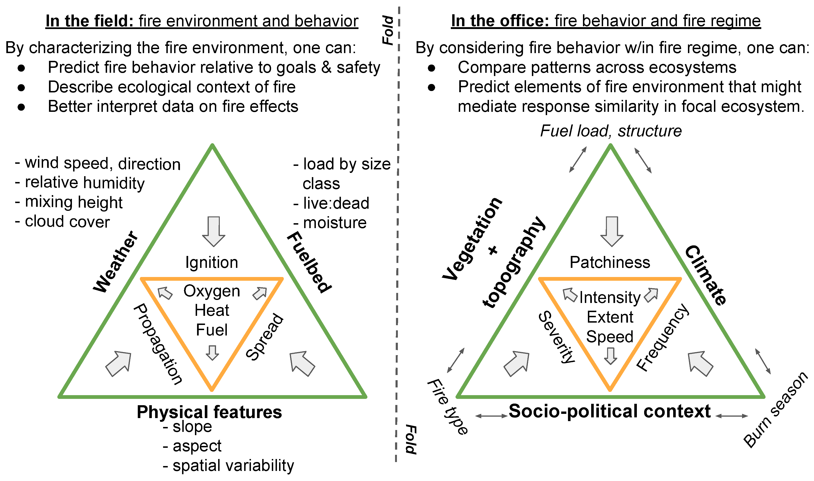

  
# Introduction 

## Background on wildland fire management and training

While the United States wildland fire community has long recognized the need to improve education and training in fuels, fire behavior, and management, a cohesive curriculum encompassing the science and practice of wildland fire use has yet to emerge.
On one hand, some of the original standards for fire management and research on the fire environment were developed in tandem, given the applied emphasis Harry Gisborne placed on using his seminal work on weather and fuel moisture to inform the preparation, deployment, and safety of fire control resources, beginning in the 1920s [@hardy1983]. 
On the other hand, while theoretically applicable to using wildland fire as well as fighting it, these standards were solidly oriented within the mode of fire suppression: the US Forest Service, having effectively defeated any support of "light burning" or other wildland fire use, controlled fire research funding as early as 1928 and by 1935 clearly established an aggressive policy of suppression [@pyne2015]. 
Enclaves of advocates for fire use moved their discussions beyond the reach of the anti-fire establishment, such as the Tall Timbers Fire Ecology Conference [@pyne2015]. 

Management agencies began to adopt prescribed burning through the latter half of the 20\textsuperscript{th} century. 
Legislative, bureaucratic, and even cultural changes first opened the National Park Service then the US Forest Service to prescribed fire that included both pre-planned and intentionally-set burns and natural ignitions allowed to spread through designated wilderness areas under prescribed conditions [@pyne2015]. 
The Nature Conservancy conducted its first prescribed fire in 1962 [@pyne2015; @tnc2022]. 

Meanwhile, management of wildland fire operations developed as well, becoming more specialized as standardized command-and-control systems evolved. 
Several disatrous fires in 1970 prompted two developments that became the National Wildfire Coordinating Group (NWCG) and the Incident Command System, which the NWCG in turn adopted and agencies widely employed by 1985 [@dague2015; @wilson1978]. 
The ICS has facilitated cross-boundary collaboration among agencies and jurisdictions in the US as well as among participating nations [@goldammer2004].
But some local fire departments bristle at the constraints of the ICS [@jensen2011], and the hierarchical structure of training, certification, and qualification for positions within the ICS can create a barrier to allowing otherwise experienced personnel conduct prescribed burns. 
In fact, as early as the 1980s, the US Fish and Wildlife Service condensed the content of 140 hours worth of NWCG coursework into a 36-hr course that combined principles of both prescribed fire and wildfire suppression, to reflect the changing demands on USFWS personnel [@murphy1987]. 

## State of wildland fire education and training today

Value of hands-on experience with experimental fires. 

Vicarious learning 

Only a few universities offer programs in prescribed fire. 
Oklahoma state University is one example that augments classroom-based courses in fire ecology with experiential learning that includes conducting prescribed fires; in a survey of 
Recent initiatives in the Society for Range Management 

Despite these advancements in prescribed fire experience, there remains a paucity of fire science integration in the education and training of wildland fire and natural resource professionals. 

Although gaps between researchers and practitioners have been described in almost every professional field from health care to conservation biology [@stott2012; @prendergast1999] and across land management broadly [@carter2020], there are substantial barriers between wildland fire scientists and managers. 

Pros and cons of the ICS
A major barrier to scientist integration with wildland fire management is the training and 
 

TNC [@tnc2022]

Let's write about fire, dudes. 
Actually, we started to do that here: @mcgranahan2021.

# Briefing 

## Leaders' intent 

## Procedure

Consistent squads--not only a reality of wildland fire operations, but role in developing empathy for group problem-solving and higher-level learning. 

### Location and equipment resources

### Personnel 

### Fire environment

# The operation 

## Hands-on fire management experience

## Hands-on fire science experience

# After Action Review

# Conclusions and recommendations

Opportunities for broader incorporation of blended learning. 

  
# References {-}